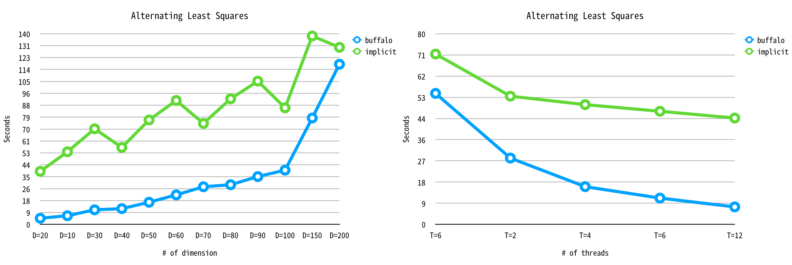
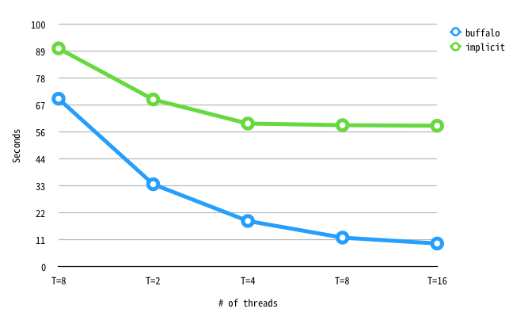

# Benchmark
We ran the benchmark with the Implicit library. The Implicit library provides ALS, BPRMF as like ours and was written in Python that easy to compare.

This benchmark can be reproduce with main.py.

- Machine
  - CPU: Intel(R) Xeon(R) CPU E5-2620 v3 @ 2.40GHz (6 cores)
  - Ram: 64GB

## Alternating Least Square

- The number of latent feature vector dimension

| method   |     D=10 |     D=20 |    D=30 |    D=40 |    D=50 |    D=60 |    D=70 |    D=80 |     D=90 |   D=100 |    D=150 |   D=200 |
|----------|----------|----------|---------|---------|---------|---------|---------|---------|----------|---------|----------|---------|
| buffalo  |  4.52909 |  6.35531 | 10.7146 | 11.5622 | 16.2517 | 21.6558 | 27.6353 | 29.1399 |  35.1215 | 39.8375 |  78.1201 | 117.606 |
| implicit | 38.947   | 53.3205  | 70.2035 | 56.5195 | 76.7012 | 90.9826 | 74.1561 | 92.2424 | 105.24   | 85.6067 | 138.357  | 130.04  |

Buffalo is faster up to 8 times.

- The number of threads

| method   |     T=1 |     T=2 |     T=4 |     T=6 |     T=12 |
|----------|---------|---------|---------|---------|----------|
| buffalo  | 54.975  | 27.8395 | 15.8394 | 11.0378 |  7.34631 |
| implicit | 71.4901 | 53.8176 | 50.2625 | 47.4736 | 44.6368  |

This showed that Buffalo library can better utilize the CPU. 

## Bayesian Personalized Ranking Matrix Factorization

- The number of latent feature vector dimension

| method   |    D=10 |    D=20 |    D=30 |    D=40 |    D=50 |    D=60 |    D=70 |    D=80 |    D=90 |   D=100 |   D=150 |   D=200 |
|----------|---------|---------|---------|---------|---------|---------|---------|---------|---------|---------|---------|---------|
| buffalo  | 15.363  | 15.8758 | 16.1761 | 15.5208 | 17.5907 | 16.9534 | 18.1864 | 18.3509 | 18.5654 | 18.4117 | 23.7365 | 26.6038 |
| implicit | 21.8934 | 25.2693 | 26.0045 | 26.0272 | 27.2161 | 29.8781 | 32.3524 | 32.9447 | 34.4455 | 35.5406 | 44.9297 | 52.3293 |

- The number of threads

| method   |      T=1 |     T=2 |     T=4 |     T=6 |    T=12 |
|----------|----------|---------|---------|---------|---------|
| buffalo  |  68.2997 | 39.2615 | 22.9208 | 18.2706 | 12.9425 |
| implicit | 130.779  | 66.9705 | 35.1379 | 27.9193 | 19.894  |
