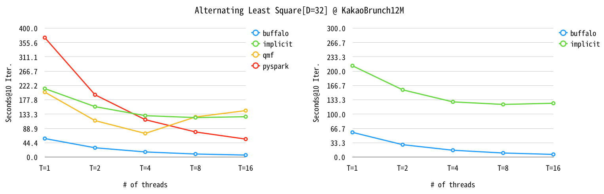
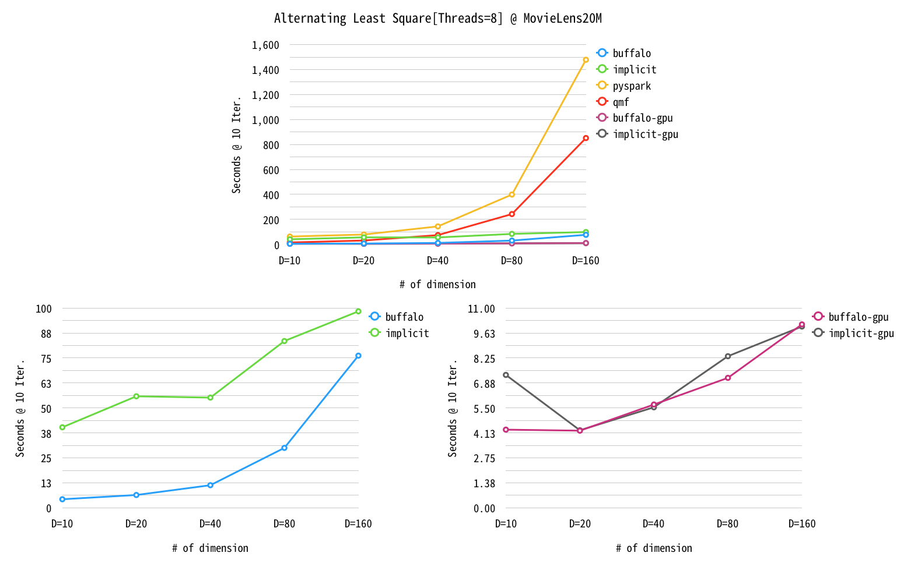

# Benchmark
We ran benchmark buffalo with the well known open source libraries so far.

- [Apache Spark](https://spark.apache.org)
- [Quora QMF](https://github.com/quora/qmf)
- [lyst LightFM](https://github.com/lyst/lightfm)
- [Implicit](https://github.com/benfred/implicit)

We tested two algorithms, ALS and BPRMF, measuring training speed and memory usage for vairous datasets. Some of libraries not support either ALS or BPRMF, in that case excluded.

- Test Environments
  - CPU Machine
    - CPU: Intel(R) Xeon(R) CPU E5-2620 v3 @ 2.40GHz (6 cores)
    - RAM: 64GB
    - SSD
  - GPU Machine
    - CPU: Intel(R) Xeon(R) Gold 5120 CPU @ 2.20GHz
    - GPU: NVIDIA Titan X (Cuda 8, we use only 1 card)
    - RAM: 64GB
    - SSD
  - gcc/g++-7.2.1
  - Python 3.6

To download the databases, please see the README.md on ./tests/.
- Databases
  - KakaoReco730
    - Sampled user reading history from Kakao annoymous service during 8 days.
  - KakaoBrunch12M
    - Sampled user reading history from [Kakao Brunch](https://brunch.co.kr) service, which is a kind of blog service, during 6 months.
  - Movielens20M
    - https://grouplens.org/datasets/movielens/

## Database Statistics
  | # USERS | # ITEMS | # NNZ
-- | -- | -- | --
MovieLens20M | 138,000 | 27,000 | 20M
KakaoBrunch12M | 306,291 | 505,926 | 12M
KakaoReco730M | 21,940,315 | 1,467,298 | 730M

* M stands for Million.
* NNZ stands for Number of Non-Zero entries.

## Alternating Least Square

- Fixed options (otherwise we let them be default except controlled options)
  - Buffalo
    - `optimizer=manual_cg num_cg_max_iters=3 compute_loss_on_training=False`
  - Buffalo-gpu
    - Same as buffalo
  - Implicit
    - `dtype=np.float32 use_cg=True use_native=True calculate_training_loss=False`
  - Implicit
    - Same as implicit
  - Spark
    - `implicitPrefs=True intermediateStroageLevel=MEMORY_ONLY finalStorageLevel=MEMORY_ONLY`
  - QMF
    - `asis`

Note that there is no Python version of QMF. Since we ran benchmark by Python script, we have to capture printed datetime information from standard output of QMF.

There is a restriction such that the number of the latent dimensions must be multiple of 32 when using GPU in implicit. For example, 80 demensions has been upscaled to 96 but not for 160. Therefore, it is not an accurate comparison between implicit-gpu and buffalo-gpu.

### KakaoReco730M
KakaoReco730M, the biggest dataset among our datasets, is handled by only buffalo and implicit with the system resource in tolerable time. Owing to lack of memory of GPU card, even implicit did not run on GPU accelerator mode. For buffalo-gpu, the memory management option `batch_mb` also worked consistently in GPU accelerator mode, allowing it to work with KakaoReco730M that data size cannot fit in memory.

- In this experiment, we set number of iteration to 2. 

### KakaoBrunch12M

method | D=10 | D=20 | D=40 | D=80 | D=160
-- | -- | -- | -- | -- | --
buffalo | 7.42076 | 9.37377 | 14.5747 | 37.2637 | 122.594
implicit | 82.8058 | 123.175 | 197.386 | 290.844 | 408.721
qmf | 63.5593 | 120.24 | 267.801 | 571.326 | 1442.09
pyspark | 55.7363 | 79.9613 | 148.842 | 485.194 | 2349.76
Buffalo-gpu | 4.08037 | 4.01108 | 5.20191 | 6.2576 | 9.16236
implicit-gpu | 5.66232 | 4.88898 | 7.8817 | 8.05288 | 11.3726

method | T=1 | T=2 | T=4 | T=8 | T=16
-- | -- | -- | -- | -- | --
buffalo | 57.4951 | 28.7919 | 15.8516 | 9.41654 | 6.14486
implicit | 212.646 | 156.561 | 128.528 | 122.587 | 125.323
qmf | 201.709 | 113.166 | 73.3526 | 124.546 | 144.251
pyspark | 370.907 | 193.428 | 116.088 | 77.8977 | 55.7786

- D setted as 20.

### Movielens20M

method | D=10 | D=20 | D=40 | D=80 | D=160
-- | -- | -- | -- | -- | --
buffalo | 4.28723 | 6.42029 | 11.3222 | 30.0026 | 76.1758
implicit | 40.308 | 55.8376 | 55.1801 | 83.4897 | 98.3676
pyspark | 62.2544 | 78.5405 | 143.538 | 398.6 | 1478.17
qmf | 14.8247 | 30.5616 | 73.8377 | 242.314 | 851.216
buffalo-gpu | 4.30483 | 4.24799 | 5.68857 | 7.1573 | 10.10027
implicit-gpu | 7.31865 | 4.27037 | 5.5366 | 8.34888 | 9.98346

method | T=1 | T=2 | T=4 | T=8 | T=16
-- | -- | -- | -- | -- | --
buffalo | 38.8911 | 19.7001 | 11.6207 | 6.15176 | 5.02124
implicit | 126.473 | 94.0671 | 72.4117 | 54.702 | 39.5668
pyspark | 422.733 | 218.339 | 123.377 | 77.7848 | 54.8635
qmf | 168.467 | 87.7365 | 46.8157 | 31.0115 | 33.9857

- D setted as 20.

## Bayesian Personalized Ranking Matrix Factorization

- Fixed options (otherwise we let them as default except controlled options)
  - Buffalo
    - `compute_loss_on_training=False`
  - Implicit
    - `dtype=np.float32 verify_negative_samples=True calculate_training_loss=False`
  - LightFM
    - `loss=bpr max_sampled=1`
  - QMF
    - `num_negative_samples=1 eval_num_neg=0`

Implicit also provides GPU accelerator mode for BPRMF, but buffalo didn't. Implicit-gpu run much faster than buffalo. We plan to add GPU accelerator feature on BPRMF in the near future, so we will update the benchmarks afterwards.

## KakaoBrunch12M

method | D=10 | D=20 | D=40 | D=80 | D=160
-- | -- | -- | -- | -- | --
buffalo | 17.1951 | 14.6433 | 15.6937 | 16.6561 | 23.426
implicit | 15.0314 | 16.1355 | 19.3006 | 25.9833 | 39.4239
qmf | 67.006193 | 76.501249 | 99.842923 | 139.275130666667 | 193.918801
lightfm | 4480.07857577006 | 4499.68288469315 | 4465.49154909452 | 4491.95924011866 | 4585.76058634122

method | T=1 | T=2 | T=4 | T=8 | T=16
-- | -- | -- | -- | -- | --
buffalo | 59.4573 | 36.8466 | 22.5258 | 16.9438 | 26.7515
implicit | 90.2548 | 42.4105 | 24.4276 | 15.6033 | 13.4407
qmf | 85.493298 | 75.46227 | 75.4510053333333 | 79.250403 | 76.7110853333333
lightfm | 4170.78732784589 | 3468.09006055196 | 3411.35963026683 | 4552.11646389961 | 5788.33071891467

## Movielens20M

# Benchmark-Parallel
This experiment is done with KakaoBrunch12M dataset to see the performance of Parallel feature.

We train the dataset with ALS and execute `most_similar` function for 10K queries. ParALS is a Parallels feature for ALS. As we can see above graph, ParALS well utilize multi-threading and ParALS N2 works blazingly fast even with a single thread. 

method | T=1 | T=2 | T=4
-- | -- | -- | --
ParALS - N2 | 0.222992 | 0.147501 | 0.0984209
ParALS | 63.9272 | 34.0839 | 21.7597
ALS | 83.6309 | 76.1695 | 74.9105

